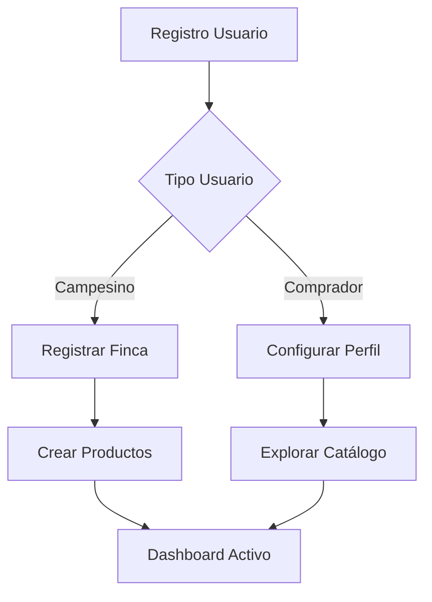
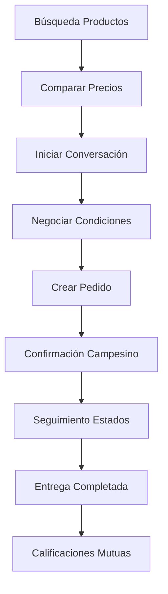

# Documentación UML - Campo Directo

## 📋 Resumen Ejecutivo

**Campo Directo** es una plataforma web desarrollada en Django que conecta campesinos directamente con compradores, eliminando intermediarios y promoviendo la transparencia en los precios agrícolas. El sistema permite a los productores ofrecer sus productos directamente y a los compradores acceder a productos frescos a precios justos.

## 📁 Estructura de la Documentación UML

Esta documentación incluye tres diagramas UML principales que cubren completamente el diseño del sistema:

### 1. [Diagrama de Clases](./UML-Diagrama-de-Clases.md)
- **Propósito**: Muestra la estructura estática del sistema
- **Contenido**: Entidades, atributos, métodos y relaciones
- **Modelos principales**: Usuario, Finca, Producto, Pedido, Conversación, Transparencia de Precios

### 2. [Diagrama de Casos de Uso](./UML-Casos-de-Uso.md)
- **Propósito**: Define las funcionalidades del sistema
- **Contenido**: 104 casos de uso organizados por actores
- **Actores**: Campesino, Comprador, Sistema, Administrador

### 3. [Diagrama de Arquitectura](./UML-Arquitectura-Sistema.md)
- **Propósito**: Describe la arquitectura técnica del sistema
- **Contenido**: Capas, componentes, flujos de datos y tecnologías
- **Incluye**: Frontend, Backend, Base de datos, Servicios externos

## 🏗️ Arquitectura General

```
┌─────────────────────────────────────────────────┐
│                Frontend Web                     │
│            (HTML + CSS + JavaScript)           │
├─────────────────────────────────────────────────┤
│                Django REST API                  │
│  ┌─────────┬─────────┬─────────┬─────────────┐  │
│  │  users  │  farms  │products │   orders    │  │
│  └─────────┴─────────┴─────────┴─────────────┘  │
├─────────────────────────────────────────────────┤
│            Base de Datos (SQLite/MySQL)         │
└─────────────────────────────────────────────────┘
```

## 🎯 Actores Principales

### 👨‍🌾 Campesino
- Registra y gestiona fincas
- Crea y administra productos
- Procesa pedidos de compradores
- Comunica directamente con clientes

### 🏢 Comprador
- Busca y compra productos
- Compara precios con mercado tradicional
- Realiza seguimiento de pedidos
- Califica a los campesinos

### ⚙️ Sistema
- Calcula transparencia de precios
- Envía notificaciones automáticas
- Genera reportes de impacto
- Mantiene datos de referencia

## 📊 Entidades Principales

### Usuario
- **Tipos**: Campesino y Comprador
- **Características**: Perfil completo, sistema de calificaciones
- **Seguridad**: Autenticación dual (Sesiones + JWT)

### Finca
- **Propósito**: Propiedades agrícolas de los campesinos
- **Datos**: Ubicación, área, tipo de cultivo, certificaciones
- **GPS**: Coordenadas para transparencia y entregas

### Producto
- **Gestión**: Stock, precios, imágenes, categorización
- **Marketplace**: Catálogo público con filtros avanzados
- **Calidad**: Sistema de etiquetas y clasificación

### Pedido
- **Flujo**: 6 estados desde "Pendiente" hasta "Completado"
- **Tracking**: Código de seguimiento único
- **Transparencia**: Historial completo de cambios

### Sistema Anti-Intermediarios
- **Conversaciones**: Chat directo campesino-comprador
- **Negociación**: Ofertas de precio en tiempo real
- **Transparencia**: Historial completo de comunicación

## 🔄 Flujos Principales

### Flujo de Registro y Setup


### Flujo de Compra Completa


## 💡 Características Innovadoras

### 1. **Transparencia de Precios**
- Comparación automática con precios SIPSA-DANE
- Cálculo de ahorros en tiempo real
- Reportes de impacto económico

### 2. **Sistema Anti-Intermediarios**
- Comunicación directa campesino-comprador
- Negociación de precios transparente
- Eliminación de sobrecostos

### 3. **Autenticación Híbrida**
- Sesiones Django para experiencia fluida
- JWT para API y aplicaciones futuras
- Seguridad multicapa

### 4. **Dashboard Dinámico**
- Datos en tiempo real del usuario
- Estadísticas de ventas/compras
- Actividad reciente personalizada

## 🛡️ Seguridad y Permisos

### Niveles de Acceso
- **Anónimo**: Solo lectura de productos públicos
- **Comprador**: Búsqueda, compra, seguimiento
- **Campesino**: Gestión completa de productos y pedidos
- **Administrador**: Control total del sistema

### Protecciones Implementadas
- CSRF protection en formularios
- Rate limiting por IP/usuario
- Validación exhaustiva de inputs
- Encriptación de contraseñas
- Permisos granulares por objeto

## 📈 Métricas y KPIs

### Para Campesinos
- Productos activos
- Pedidos pendientes
- Ventas mensuales
- Calificación promedio

### Para Compradores
- Pedidos realizados
- Total gastado
- Ahorros generados
- Campesinos favoritos

### Para el Sistema
- Transacciones totales
- Ahorro económico generado
- Usuarios beneficiados
- Productos más transados

## 🔮 Roadmap Técnico

### Fase Actual ✅
- ✅ Sistema de usuarios y autenticación
- ✅ Gestión de fincas y productos
- ✅ Sistema de pedidos completo
- ✅ Dashboard dinámico
- ✅ Comunicación directa

### Próximas Fases 🚧
- 🔄 Sistema de pagos integrado (PSE, Bancolombia)
- 🔄 Notificaciones SMS/WhatsApp
- 🔄 App móvil nativa
- 🔄 Cache con Redis
- 🔄 CDN para imágenes

### Futuro 🎯
- 📱 PWA (Progressive Web App)
- 🤖 IA para recomendaciones
- 📊 Analytics avanzados
- 🌐 Expansión internacional
- 🔗 Integración blockchain

## 🏆 Ventajas Competitivas

### Técnicas
- **Arquitectura escalable**: Django + REST API
- **Base de datos optimizada**: Índices y relaciones eficientes
- **Frontend responsivo**: Diseño mobile-first
- **API documentada**: Swagger/OpenAPI completo

### De Negocio
- **Eliminación de intermediarios**: Conexión directa
- **Transparencia total**: Precios y comunicación abierta
- **Impacto social**: Beneficio para productores rurales
- **Sostenibilidad**: Reducción de cadena de distribución

## 📚 Guías de Implementación

### Para Desarrolladores
1. **Setup**: Seguir README principal del proyecto
2. **Modelos**: Revisar `models.py` en cada app
3. **APIs**: Documentación en `/api/docs/`
4. **Frontend**: Estructura en `templates/` y `static/`

### Para QA/Testing
1. **Casos de Uso**: 104 escenarios documentados
2. **Flujos críticos**: Registro, compra, pago, seguimiento
3. **Permisos**: Matriz de acceso por tipo de usuario
4. **APIs**: Endpoints con ejemplos de payload

### Para DevOps
1. **Arquitectura**: Diagrama de componentes completo
2. **Dependencias**: Lista de tecnologías y versiones
3. **Escalabilidad**: Estrategias horizontal y vertical
4. **Monitoreo**: Health checks y métricas

---

**Campo Directo** representa una solución tecnológica integral que no solo conecta campesinos con compradores, sino que transforma la manera en que se comercializan los productos agrícolas en Colombia, promoviendo la transparencia, la justicia económica y el desarrollo rural sostenible.

## 📞 Contacto y Soporte

- **Documentación Técnica**: Ver archivos UML individuales
- **API Reference**: `/api/docs/` (Swagger UI)
- **Código Fuente**: Revisar estructura de apps Django
- **Diagramas**: Formato Mermaid para visualización en GitHub/GitLab