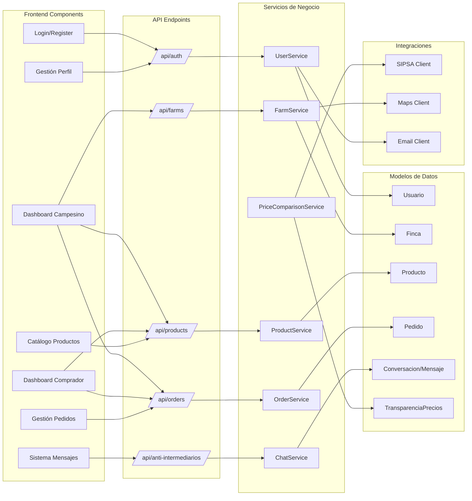
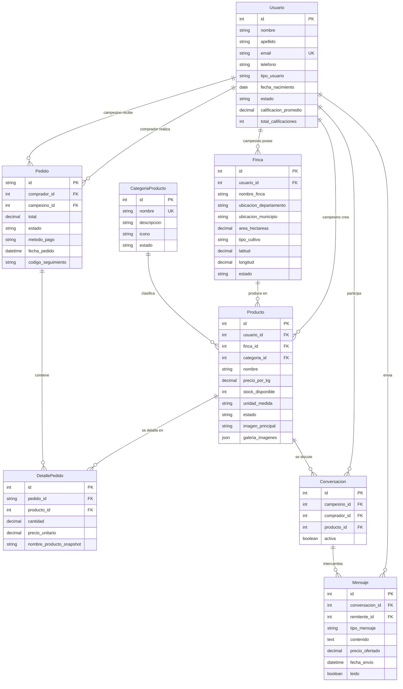
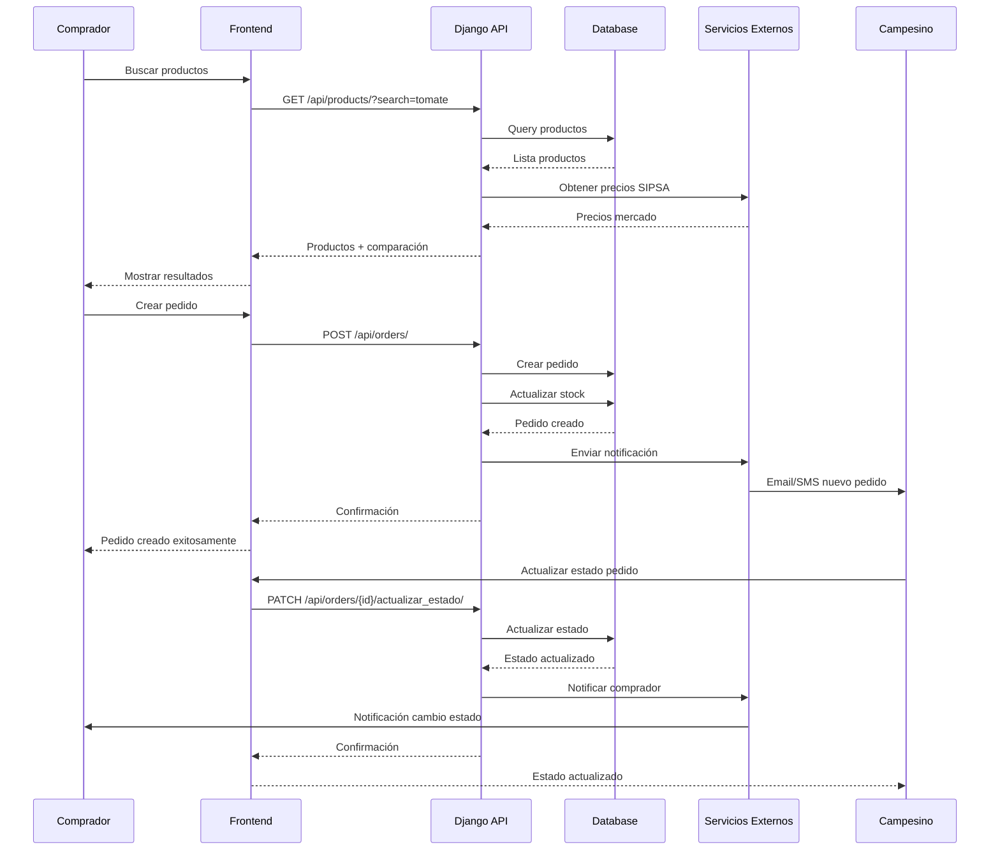

# Diagrama de Arquitectura del Sistema - Campo Directo

## Resumen de la Arquitectura
Campo Directo utiliza una arquitectura Django REST API con frontend web, base de datos relacional, y servicios externos para funcionalidades específicas como geolocalización y comparación de precios.

## Diagrama de Arquitectura del Sistema

```mermaid
graph TB
    %% Frontend Layer
    subgraph "Capa de Presentación"
        WEB[🌐 Frontend Web<br/>HTML + CSS + JavaScript]
        MOB[📱 App Móvil<br/>(Futuro)]
        API_DOC[📚 Documentación API<br/>Swagger/OpenAPI]
    end

    %% API Gateway / Load Balancer
    subgraph "Entrada del Sistema"
        LB[⚖️ Load Balancer<br/>Nginx/Apache]
        CDN[☁️ CDN<br/>Archivos Estáticos]
    end

    %% Application Layer
    subgraph "Capa de Aplicación"
        DJANGO[🎯 Django Framework]
        
        subgraph "Apps Django"
            USERS[👥 users<br/>Autenticación]
            FARMS[🚜 farms<br/>Fincas]
            PRODUCTS[🥬 products<br/>Productos]
            ORDERS[📦 orders<br/>Pedidos]
            ANTI[🚫 anti_intermediarios<br/>Comunicación]
            FRONTEND[🖥️ frontend<br/>Vistas Web]
        end
        
        subgraph "API Layer"
            DRF[🔌 Django REST Framework]
            JWT[🔐 JWT Authentication]
            SWAGGER[📋 API Documentation]
        end
    end

    %% Business Logic
    subgraph "Lógica de Negocio"
        SERIALIZERS[📄 Serializers<br/>Validación de Datos]
        PERMISSIONS[🛡️ Permisos<br/>Autorización]
        SIGNALS[⚡ Signals<br/>Eventos]
        TASKS[⏰ Tareas Async<br/>Celery (Futuro)]
    end

    %% Data Layer
    subgraph "Capa de Datos"
        DB[(🗄️ Base de Datos<br/>SQLite/MySQL)]
        REDIS[(🔴 Redis<br/>Cache/Sessions)]
        FILES[📁 Almacenamiento<br/>Media Files]
    end

    %% External Services
    subgraph "Servicios Externos"
        SIPSA[📊 SIPSA-DANE<br/>Precios de Referencia]
        MAPS[🗺️ Google Maps<br/>Geolocalización]
        EMAIL[📧 Servicio Email<br/>SMTP]
        PAYMENT[💳 Pagos<br/>(Futuro)]
        SMS[📱 SMS<br/>(Futuro)]
    end

    %% Security Layer
    subgraph "Seguridad"
        HTTPS[🔒 HTTPS/SSL]
        CSRF[🛡️ CSRF Protection]
        CORS[🌐 CORS]
        RATE[⚡ Rate Limiting]
    end

    %% Monitoring
    subgraph "Monitoreo"
        LOGS[📝 Logging]
        METRICS[📊 Metrics]
        HEALTH[❤️ Health Checks]
    end

    %% Connections
    WEB --> LB
    MOB --> LB
    API_DOC --> LB
    
    LB --> HTTPS
    HTTPS --> DJANGO
    
    DJANGO --> USERS
    DJANGO --> FARMS  
    DJANGO --> PRODUCTS
    DJANGO --> ORDERS
    DJANGO --> ANTI
    DJANGO --> FRONTEND
    
    DJANGO --> DRF
    DRF --> JWT
    DRF --> SWAGGER
    
    DJANGO --> SERIALIZERS
    DJANGO --> PERMISSIONS
    DJANGO --> SIGNALS
    DJANGO --> TASKS
    
    DJANGO --> DB
    DJANGO --> REDIS
    DJANGO --> FILES
    
    DJANGO --> SIPSA
    DJANGO --> MAPS
    DJANGO --> EMAIL
    DJANGO --> PAYMENT
    DJANGO --> SMS
    
    DJANGO --> CSRF
    DJANGO --> CORS
    DJANGO --> RATE
    
    DJANGO --> LOGS
    DJANGO --> METRICS
    DJANGO --> HEALTH
    
    CDN --> FILES
```

## Diagrama de Componentes Detallado



## Arquitectura de Datos



## Flujo de Datos Principal



## Tecnologías y Dependencias

### Backend
- **Framework**: Django 4.x
- **API**: Django REST Framework
- **Autenticación**: JWT (Simple JWT)
- **Base de Datos**: SQLite (desarrollo), MySQL (producción)
- **Cache**: Redis (futuro)
- **Documentación**: drf-yasg (Swagger)
- **Validación**: Django Serializers
- **Archivos**: Django File Handling

### Frontend
- **Tecnología**: HTML5 + CSS3 + JavaScript (Vanilla)
- **UI Framework**: Bootstrap 5
- **Iconos**: Font Awesome
- **Charts**: Chart.js
- **AJAX**: Fetch API

### Infraestructura
- **Servidor Web**: Nginx/Apache
- **WSGI**: Gunicorn
- **Base de Datos**: MySQL/PostgreSQL
- **Cache**: Redis
- **Archivos Estáticos**: CDN/S3 (futuro)
- **SSL**: Let's Encrypt

### Servicios Externos
- **Precios**: SIPSA-DANE API
- **Mapas**: Google Maps API
- **Email**: SMTP (Gmail, SendGrid)
- **Pagos**: PSE, Bancolombia (futuro)
- **SMS**: Twilio (futuro)

## Seguridad

### Autenticación y Autorización
- Sistema dual: Sesiones Django + JWT
- Permisos basados en roles (campesino/comprador)
- Rate limiting por IP/usuario
- CORS configurado para dominios específicos

### Protección de Datos
- HTTPS obligatorio en producción
- Validación CSRF en formularios
- Sanitización de inputs
- Encriptación de contraseñas (PBKDF2)
- Validación de archivos subidos

### Auditoría
- Logging completo de acciones críticas
- Timestamps en todas las entidades
- Tracking de cambios en pedidos
- Monitoreo de intentos de acceso fallidos

## Escalabilidad

### Horizontal
- Load balancer para múltiples instancias Django
- Base de datos con replicas de lectura
- CDN para archivos estáticos
- Cache distribuido con Redis Cluster

### Vertical
- Optimización de queries ORM
- Índices en campos críticos
- Paginación en listados grandes
- Lazy loading de relaciones

### Monitoreo
- Health checks automáticos
- Métricas de rendimiento
- Alertas por errores críticos
- Dashboard de administración

Este diagrama UML de arquitectura proporciona una visión completa del sistema Campo Directo, mostrando cómo los diferentes componentes interactúan entre sí para proporcionar una plataforma robusta y escalable que conecta directamente campesinos con compradores.