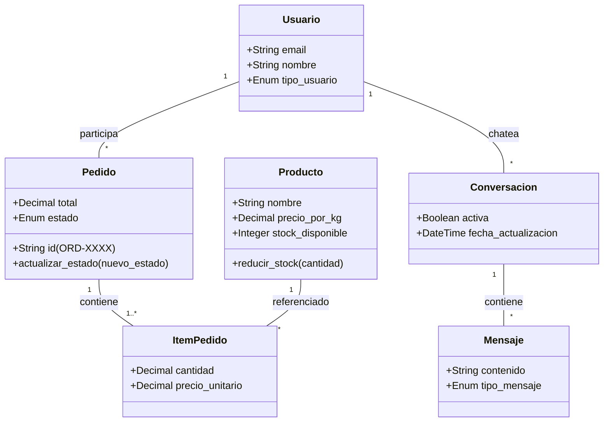
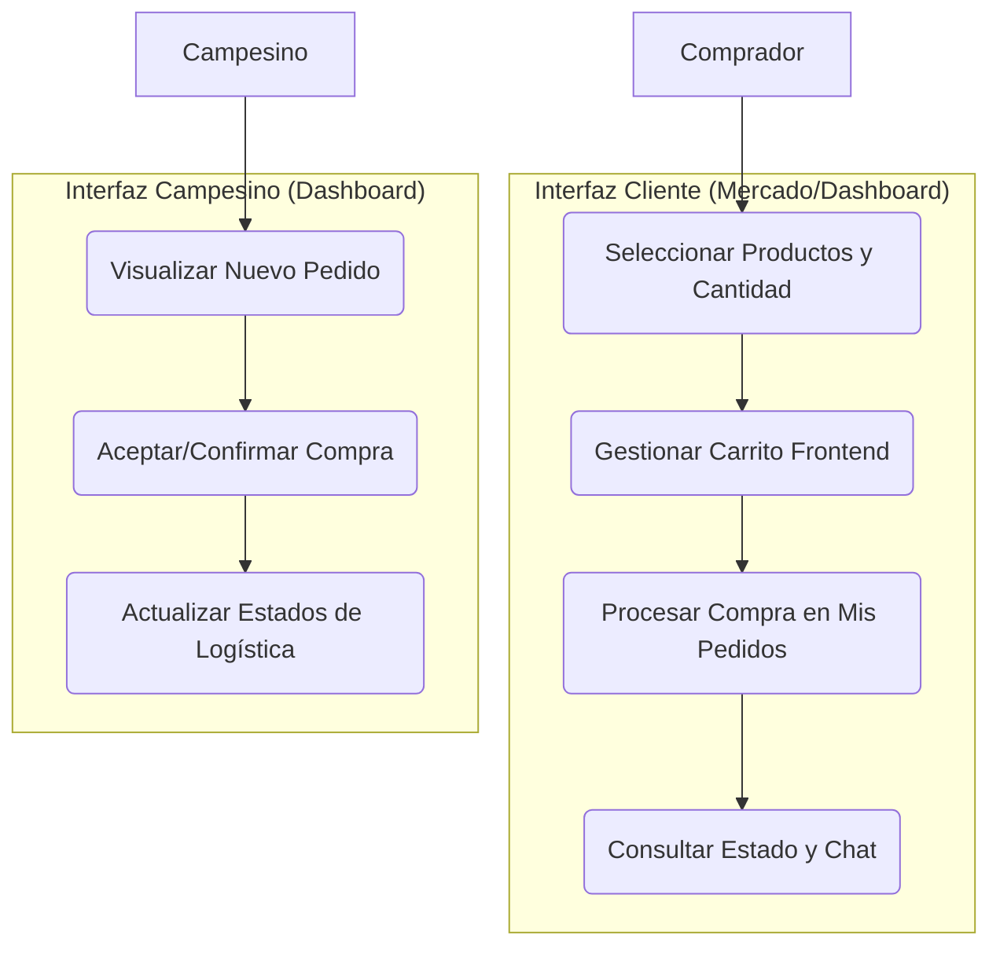
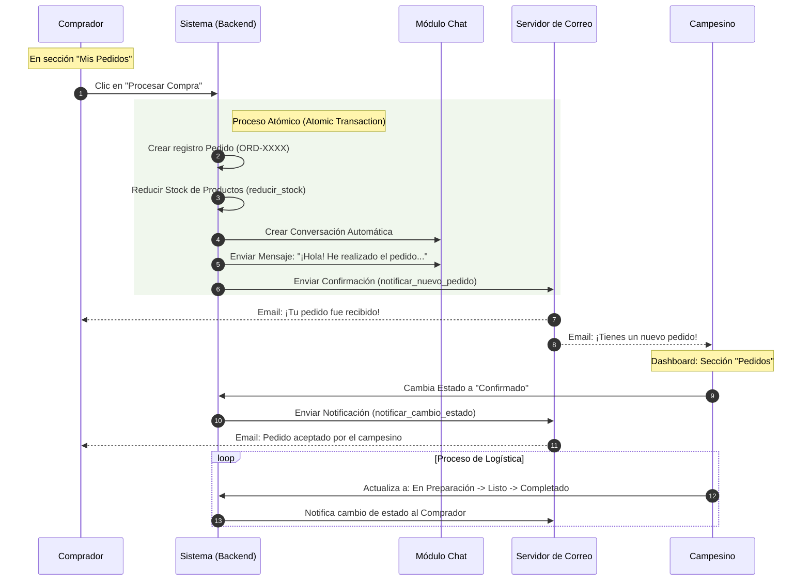
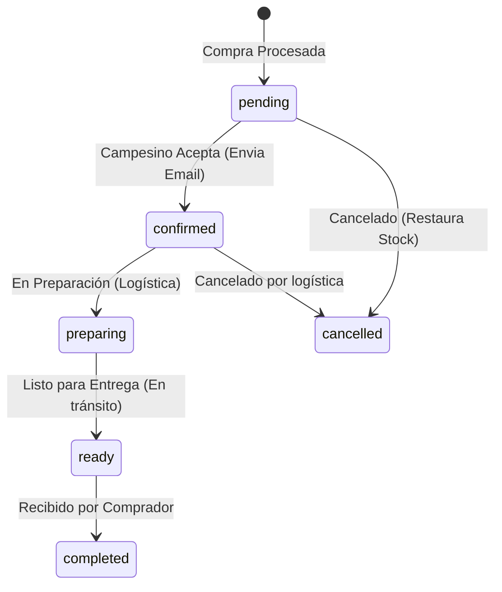
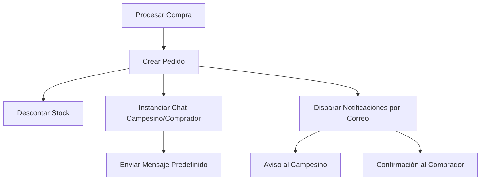

# Documentación Técnica UML - Campo Directo (Proceso Verificado)

Esta documentación refleja el flujo transaccional real del sistema, incluyendo automatizaciones de chat y notificaciones por correo electrónico.

## 1. Diagrama de Clases (Estructura de Datos)

---

## 2. Diagrama de Casos de Uso (Flujo de Usuario)

---

## 3. Diagrama de Secuencia: "Coreografía del Pedido"

Este diagrama muestra cómo un solo clic en "Procesar Compra" desencadena múltiples acciones automáticas en el servidor.

---

## 4. Diagrama de Estados (Ciclo Logístico Real)

Los nombres de los estados coinciden exactamente con los `ESTADO_CHOICES` del código.

---

## 5. Arquitectura de Notificaciones Automatizadas

> [!TIP]
> **Dato verificado en código:** El mensaje del chat utiliza los datos reales de la dirección y teléfono del comprador capturados en el proceso de compra.
